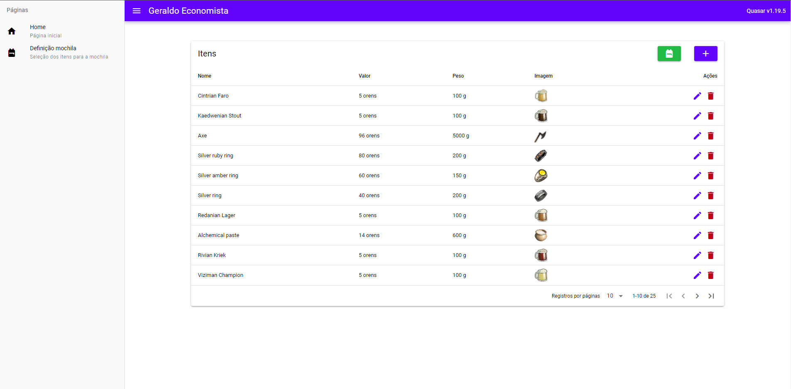

# Geraldo Economista

**Conteúdo da Disciplina**: PD<br>

## Alunos
| Matrícula | Aluno |
| -- | -- |
| 18/0018728  |  Igor Batista Paiva |
| 18/0028260  |  Thiago Aparecido Lopes Santos |

## Sobre
O software é inspirado no inventário do jogo The Witcher e tem como objetivo auxiliar o jogador a escolher quais são os melhores itens que cabem em seu inventário levando em consideração os itens do usuário e o limite de peso do seu inventário.

O vídeo da apresentação pode ser encontrado clicando [aqui](https://github.com/projeto-de-algoritmos/PD_GeraldoEconomista/blob/main/apresentacao.mp4?raw=true).

## Screenshots

### Tela de gerência dos itens


### Modal de criação de novo item


### Página de seleção de itens para a mochila


### Página de resultado das mochilas


## Instalação
**Linguagem**: Javascript (frontend) e Python (backend)<br>
**Framework**: Vue.js(frontend) e Flask (backend)<br>

Para rodar o projeto, é necessário que ter o [docker](https://www.docker.com/) e o [docker-compose](https://docs.docker.com/compose/install/) instalados.

Posteriormente, execute:

```
docker-compose up
```

Para realizar a primeira instalação e iniciar o projeto.

Para acessar o frontend, acesse seu [localhost](http://localhost:8080) na porta 8080.

## Uso
No frontend, existem duas telas, uma para a separação dos itens desejados e uma para gerência dos itens cadastrados. Na página de separação, o usuário poderá escolher quais os itens desejados para a análise, tal como o peso máximo do inventário. Após a execução, será mostrado quais são os melhores itens para serem mantidos levando em consideração seu peso e valor.

Obs.: Na página de gerência dos itens contém um botão para popular a base de itens cadastrados com itens temáticos do jogo. Caso prefire criar seus próprios itens, fique à vontade.
